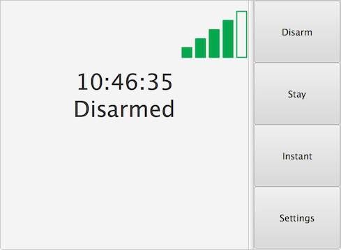
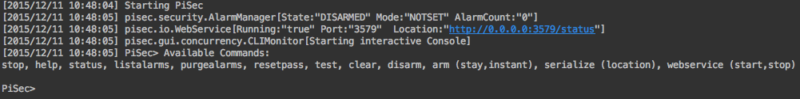

# PiSec    
### A home security system that runs on the Raspberry Pi + Touchscreen
===  

PiSec is a home security system for the RaspberryPi using Java 8 + JavaFX. This was just a fun little project I made to learn the finer points of JavaFX and to poke around the Raspberry Pi (this is my first project with the Raspberry Pi).

PiSec Features:
* Touch Screen GUI with WiFi status
* Comandline access
* Network status query
* Zones
* Alarm e-mail alerts with pictures
* [Companion Android App](https://github.com/binarybird/PiSec-Android)

In its default configuration, PiSec looks for one magnetic door sensor (pin 28 - RaspPi 2 Model B), one motion sensor (pin 29 - RaspPi 2 Model B), and one camera (raspistill). This can be extended to as many devices as you want, in as many Zones as you want. And yes, the password you set for PiSec is required for all actions in the GUI and the CLI.

===

####Quick code rundown:
##### pisec.security.AlarmManager
AlarmManager manages the state of the Alarm (Armed, Disarmed, Alarmed, etc..) as well as performing actions based on the Alarm state.
##### pisec.gui.controller.RootPaneController
RootPaneController manages the JavaFX GUI
##### pisec.device.DeviceManager
DeviceManager manages external devices connected to the I/O pins of the Raspberry Pi
##### pisec.io.WebService
WebService manages the JAXWS query service for the status of PiSec
##### pisec.gui.concurrency.CLIMonitor
CLIMonitor runs the command line interface for PiSec

===

#### RaspBerry Pi setup
The version of JavaFx shipped with NOOBS OS does not work with many touch screens. [See my post here for a fix](https://www.raspberrypi.org/forums/viewtopic.php?f=108&t=121268&p=818759#p818759)

